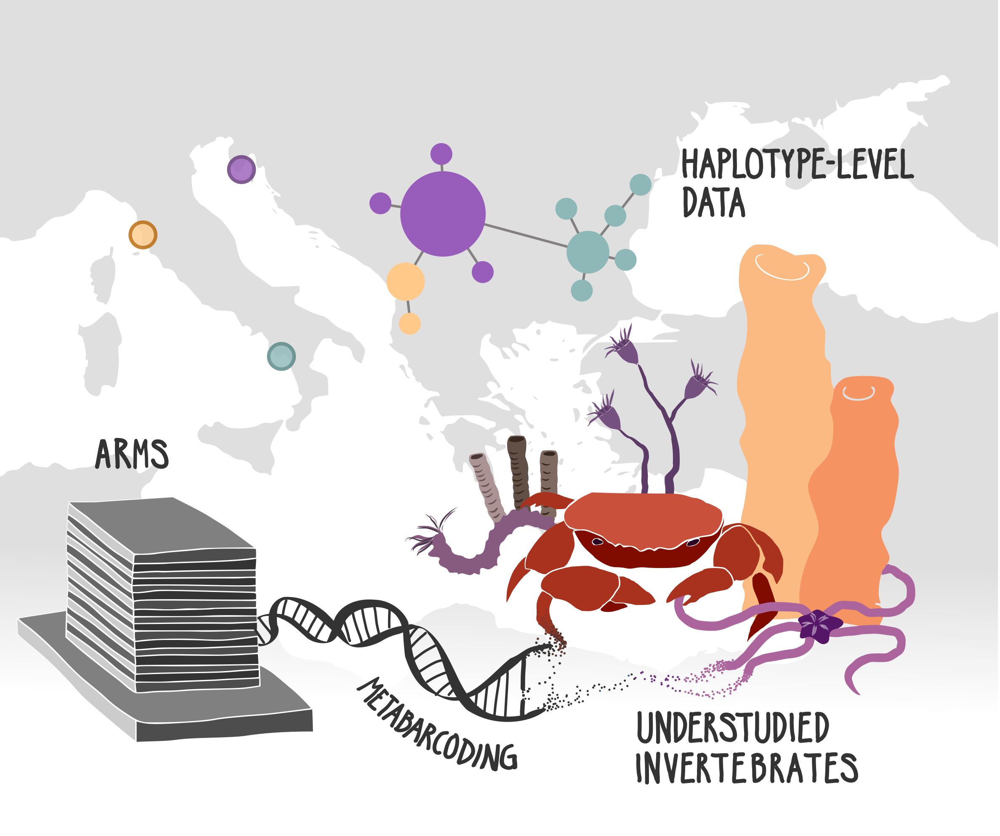

# Spineless and overlooked
Scripts associated with the article "Spineless and overlooked: DNA metabarcoding of autonomous reef monitoring structures reveals intra- and interspecific genetic diversity in Mediterranean invertebrates".

The pipeline was put together to extract haplotype data (intraspecific genetic information) from marine invertebrates collected from ARMS in the Mediterranean sea. Data collection was part of the <a href="https://seamobb.osupytheas.fr/">SeaMoBB project</a>.

<a href="https://doi.org/10.1111/1755-0998.13836">Link to article in MER</a>

Sequence data, pipeline outputs and other deposited data: <a href="https://doi.org/10.5281/zenodo.7781906">10.5281/zenodo.7781906</a>

  

